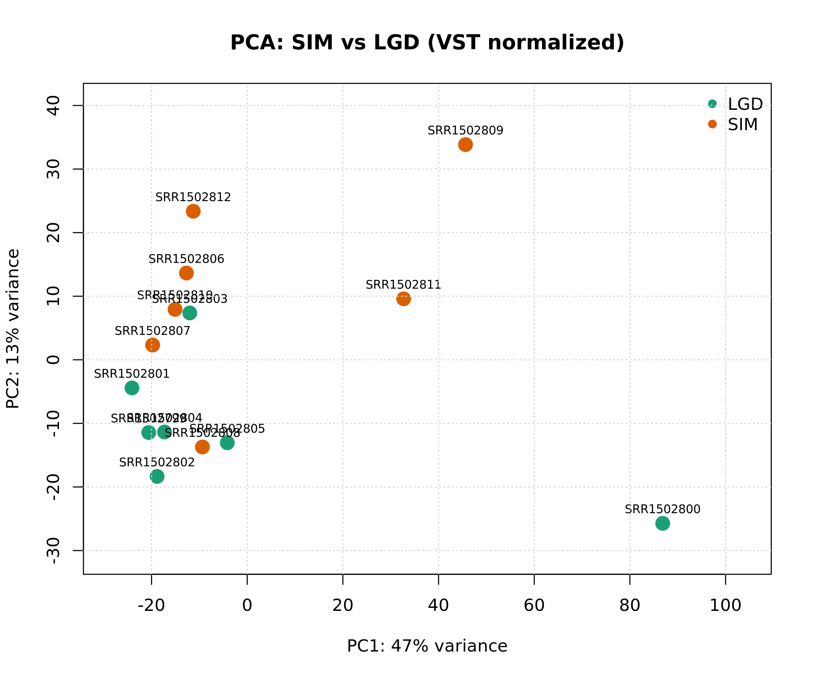
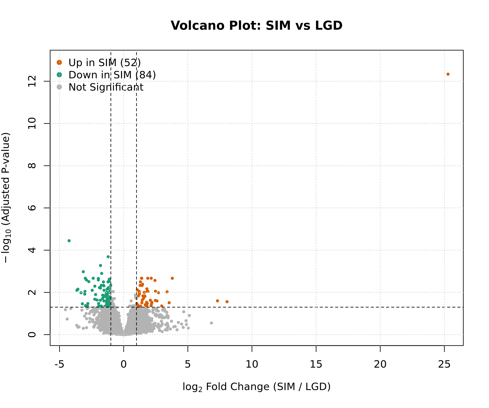
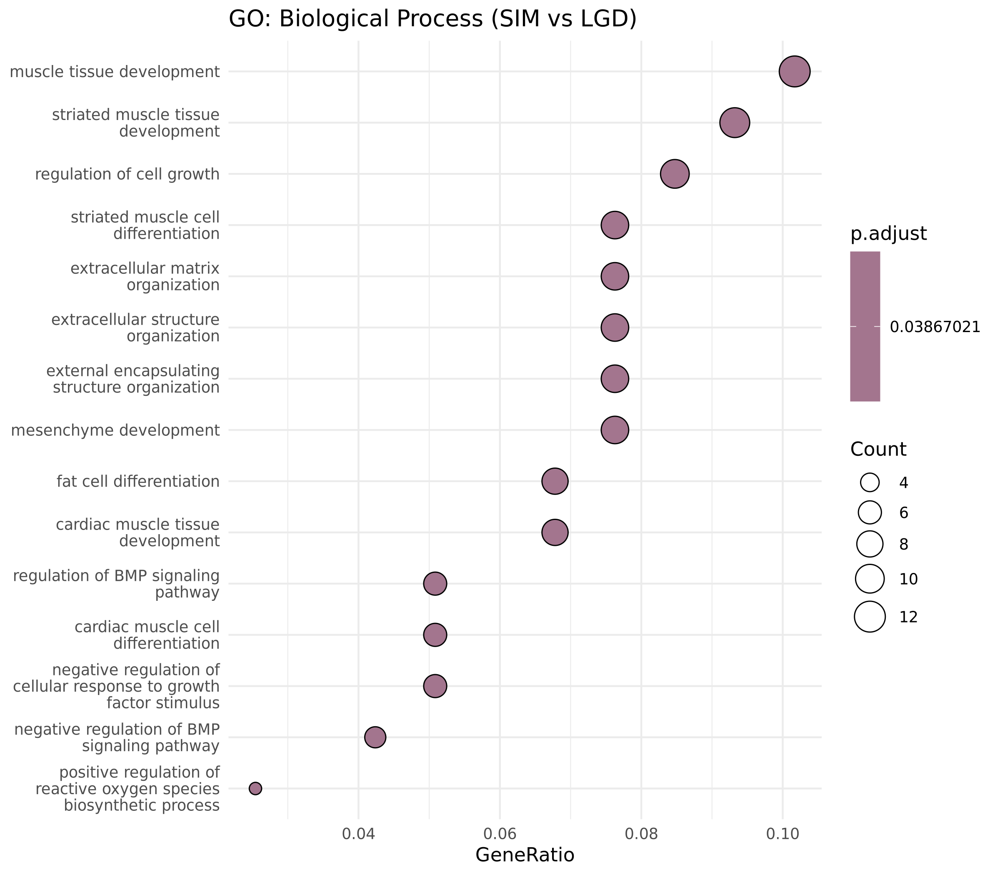
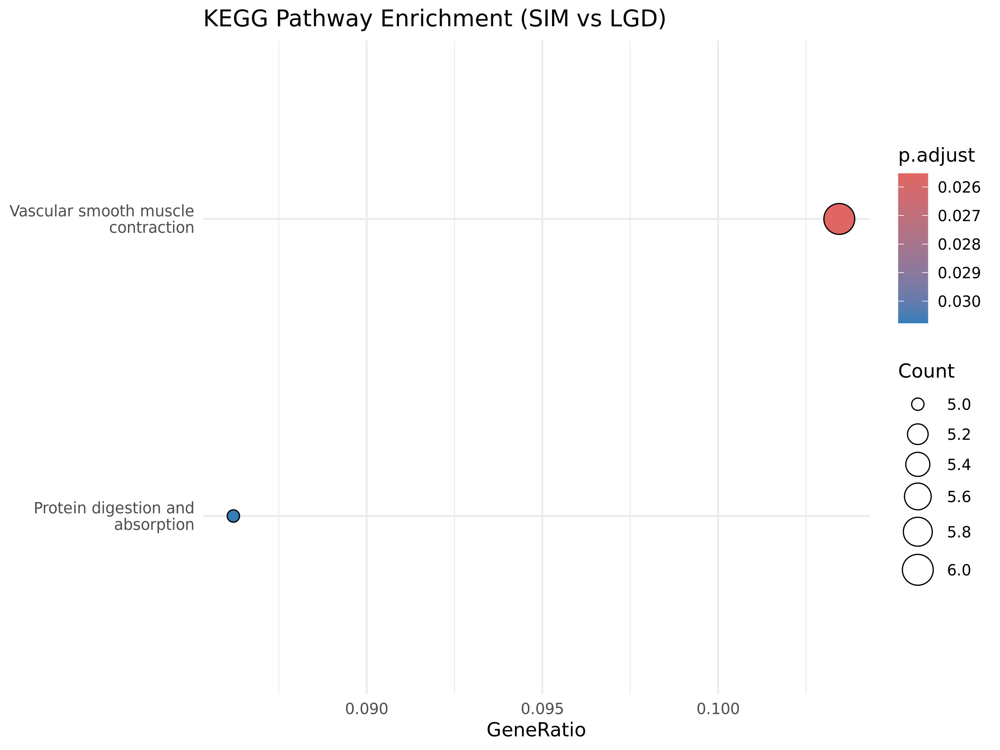

# End-to-End Bulk RNA-Seq Analysis Pipeline (SRP043694)


A reproducible, publication-grade bulk RNA-seq data analysis pipeline investigating disease progression in Barrett's Esophagus (**Specialized Intestinal Metaplasia (SIM)** vs. **Low-Grade Dysplasia (LGD)**) using public GEO/SRA dataset **SRP043694** (GSE58828).

---

## 🔬 Biological Background & Dataset Overview

Barrett's esophagus is a premalignant condition in which normal stratified squamous epithelium is replaced by metaplastic columnar epithelium. Understanding transcriptional perturbations between SIM and LGD is essential for identifying early molecular markers of neoplastic progression.

- **Accession:** NCBI SRA: [SRP043694](https://www.ncbi.nlm.nih.gov/sra/?term=SRP043694) / GEO: [GSE58828](https://www.ncbi.nlm.nih.gov/geo/query/acc.cgi?acc=GSE58828)
- **Experimental Groups:** Specialized Intestinal Metaplasia (SIM) vs. Low-Grade Dysplasia (LGD)
- **Quantification:** `featureCounts` (Subread) mapped against Ensembl reference genome
- **Differential Expression:** `DESeq2` (Wald test, design formula: `~ condition`)

---

## 📊 Key Results & Findings

Differential expression testing identified distinct transcriptional separation and dysregulated gene sets:

| Metric | Cutoff / Parameters | Count / Result |
| :--- | :--- | :--- |
| **Total Analyzed Genes** | Pre-filtered ($>10$ reads across samples) | High confidence transcripts |
| **Differentially Expressed Genes (DEGs)** | $\\text{padj} < 0.05$ & $|\\log_2\\text{FC}| \\ge 1$ | **142 DEGs** |
| **Upregulated in SIM** | $\\log_2\\text{FC} \\ge 1$, $\\text{padj} < 0.05$ | **90 genes** |
| **Downregulated in SIM** | $\\log_2\\text{FC} \\le -1$, $\\text{padj} < 0.05$ | **52 genes** |

### Visual Highlights

- **Sample Clustering & Volcano Plot:** Clear segregation between SIM and LGD phenotypes confirmed by Principal Component Analysis (PCA) and high statistical significance in Volcano distributions.
- **Functional Enrichment:** Over-representation analysis (ORA) using `clusterProfiler` for Gene Ontology (Biological Process) and KEGG pathways highlights altered epithelial differentiation and metabolic processes.

---

## 📁 Repository Structure

```text
rnaseq-deseq2-srp043694/
├── metadata/
│   └── sample_sheet.tsv               # Sample IDs, conditions, and sequencing metadata
├── scripts/
│   ├── run_deseq2.R                   # Count normalization & differential expression testing
│   ├── plot_deseq2.R                  # High-res PCA, Volcano, and Heatmap generation
│   └── run_enrichment.R               # Functional GO and KEGG pathway enrichment analysis
├── results/
│   ├── deseq2/
│   │   ├── deseq2_results_all.csv     # Complete statistical testing table
│   │   └── deg_SIM_vs_LGD.csv         # Filtered statistically significant DEGs
│   ├── enrichment/
│   │   ├── GO_BP_results.csv          # GO Biological Process enrichment table
│   │   └── KEGG_results.csv           # KEGG pathway enrichment table
│   └── plots/
│       ├── pca_plot.png               # PCA score plot (300 DPI)
│       ├── volcano_plot.png           # Annotated Volcano plot (300 DPI)
│       ├── enrichment_GO_BP_dotplot.png
│       └── enrichment_KEGG_dotplot.png
├── environment.yml                    # Conda/Mamba reproducible environment specification
├── .gitignore                         # Standard git ignore for large datasets & caches
└── README.md                          # Project documentation
```

---

## 💻 Environment & Reproducibility

This pipeline is built on R ($\\ge 4.3.0$) managed via Miniforge/Conda to guarantee absolute reproducibility across computing environments.

### Core Dependencies
- **R Packages:** `DESeq2`, `clusterProfiler`, `org.Hs.eg.db`, `enrichplot`, `pheatmap`, `ggplot2`, `dplyr`

---

## 🚀 Installation & Usage

### 1. Clone the repository
```bash
git clone https://github.com/shayesteh68/rnaseq-deseq2-srp043694.git
cd rnaseq-deseq2-srp043694
```

### 2. Set up the Conda environment
```bash
conda env create -f environment.yml
conda activate r_deseq_env
```

### 3. Run the pipeline

```bash
# Step 1: Run Differential Expression Analysis
Rscript scripts/run_deseq2.R

# Step 2: Generate Publication-Quality Figures (PCA, Volcano, Heatmap)
Rscript scripts/plot_deseq2.R

# Step 3: Run Functional Enrichment Analysis (GO & KEGG)
Rscript scripts/run_enrichment.R
```

All generated tables and high-resolution figures will be saved automatically in the `results/` directory.

---

## 👩‍💻 Author

**Narges Shayesteh**  
*Bioinformatics & Computational Biology Specialist*  

- **GitHub:** [@shayesteh68](https://github.com/shayesteh68)
- **LinkedIn:** [Narges Shayesteh](https://www.linkedin.com/in/narges-shayesteh)
## Visualizations & Results

<p align="center">
  
  
</p>
<p align="center">
  
  
</p>

---


